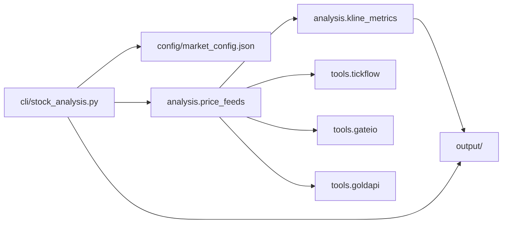

# Stock_Analysis

多市场 K 线技术分析流水线：**拉取 OHLCV → 指标与结构（Fib、Wyckoff 背景、123 等）→ 生成 Markdown / JSON**；可选接入研报检索（研报客）。输出含简报、总览 JSON、全文报告及程序生成的台账快照。

**合规声明**：技术分析与程序化演示用途，不构成投资建议。

---

## 项目概述

| 维度 | 说明 |
|------|------|
| 形态 | Python 为主；CLI 驱动批处理；可选 HTTP Agent API（FastAPI）与飞书机器人入口 |
| 行情源 | 可插拔 provider：`tickflow`（默认）、`gateio`（加密）、`goldapi`（贵金属） |
| 文档产物 | `output/<provider>/<market>/<日期>/` 下 `ai_brief.md`、`ai_overview.json`、`full_report.md` |
| 契约文档 | `AGENTS.md`（Agent 调度与数据源边界）、`AI_股票对话提示.md`（细则）、`docs/NAMESPACE.md`（模块速查） |

---

## 架构要点

- **分层**：`cli/` 只做入口与参数；`app/` 编排、报告写入、**应用侧**台账流程（`journal_service` 等）；**`persistence/`** 集中 PostgreSQL 连接、台账仓库、账户与纸交易写入；`analysis/` 指标与业务规则（`price_feeds` 仅负责 provider 分发与 OHLCV 归一化）；`tools/<provider>/` 存放各数据源 HTTP 客户端。
- **外部数据**：行情请求不写在 `analysis/` 内部实现里，而是通过 `tools/` 与 `price_feeds` 接入。
- **可选 LLM**：分析链路可接入 LLM（决策与校验见 `app/`、`tools/llm/`，当前默认 provider 为 DeepSeek）；路由层另有飞书意图路由（function calling）。
- **预留域**：`market_data/` 计划承接板块/资金流等结构化数据，当前未实现。



---

## 目录结构（摘要）

| 路径 | 职责 |
|------|------|
| `cli/` | 命令行入口 |
| `app/` | 编排、报告、台账、可选 API 与飞书服务 |
| `analysis/` | 指标、台账策略、价格汇聚 |
| `intel/` | 研报客客户端（检索与落盘） |
| `config/` | `market_config.json`、YAML 配置模板与运行时读取 |
| `tools/` | 各 provider 客户端、`yanbaoke` Node 脚本 |
| `market_data/` | 预留 |
| `tests/` | 单元与契约测试 |

扩展点：新数据源 → `tools/<provider>/client.py` + `analysis/price_feeds.py`；新指标/报告字段 → `analysis/`；默认标的 → `config/market_config.json`。细则见下文「扩展对照表」。

---

## 环境与依赖

```bash
pip install -r requirements.txt
```

- 研报检索依赖 **Node.js 18+**（与 `intel/`、`tools/yanbaoke/` 脚本配合）。
- 回归测试：`python -m unittest discover -s tests -p "test_*.py"`

敏感配置：复制 `config/analysis_defaults.example.yaml` 为 `config/analysis_defaults.yaml`（后者通常不入库）。读取顺序见 `config/runtime_config.py`。

---

## 配置要点

- **`config/market_config.json`**：`symbol`、`name`、`market`、`data_symbol`、`default_symbols` 等。
- **密钥与环境变量**：各 provider 的 Key 与覆盖方式见下文表格及 `config/analysis_defaults.example.yaml` 注释。
- **DeepSeek（可选）**：`DEEPSEEK_API_KEY`；可选 `DEEPSEEK_BASE_URL`、`DEEPSEEK_MODEL`、`AGENT_ENABLE_LLM`。

---

## 数据源与环境变量（摘要）

| provider | 用途 | Key 需求（摘要） |
|----------|------|------------------|
| `tickflow` | 默认行情 | 可选 `TICKFLOW_API_KEY` |
| `gateio` | 加密货币 K 线 | 公共行情接口，无需 Key |
| `goldapi` | 贵金属 | `GOLD_API_APPKEY` / `GOLD_API_KEY` 等，见客户端与示例配置 |
| 研报客 | 检索/摘要 | 搜索通常可不配置；下载需 `YANBAOKE_API_KEY` |

贵金属接口细节按官方文档使用 `/api/v1/gold/varieties` 与 `/api/v1/gold/history`；当前在项目内归一化支持 `1h` / `4h` / `1d`。

---

## 命令示例

均在仓库根目录执行。

```bash
# 默认标的简报（tickflow）
python cli/stock_analysis.py --market-brief --report-only --out-dir output

# 单标的
python cli/stock_analysis.py --symbol AAPL --interval 1d --limit 180 --report-only --out-dir output

# 简报 + 研报线索（需 Node）
python cli/stock_analysis.py --market-brief --report-only --out-dir output --with-research --research-n 5

# 贵金属示例
python cli/stock_analysis.py --provider goldapi --symbol AU9999 --interval 1d --limit 180 --report-only --out-dir output
```

台账统计（独立）：`python analysis/ledger_stats.py --journal output/tickflow/US_STOCK/2026-01-01/journal`（`--journal` 为**会话目录**下的锚点文件路径，统计 Markdown 写在同目录；台账行来自 PostgreSQL `journal_ideas`）

启用 `--with-research` 时，研报目录与 CLI 约定一致（与单独 `cli/yb_search.py` 的落盘路径可能不同，以脚本说明为准）。

---

## 输出与指标（简要）

- **指标示例**：SMA、窗口涨跌、 swing 高/低、Fib、趋势标签、Wyckoff 背景、123 结构字段等（具体字段以生成 JSON/Markdown 为准）。
- **台账**：**PostgreSQL** `journal_*`（需 `database.postgres.dsn`）；各次分析会话目录下有锚点文件 `journal` 及统计快照 `trade_journal_stats_latest.md` 等；非交易所成交；写入规则见 `analysis/journal_policy.py` 与配置中的 `min_journal_rr` 等。

---

## Agent API 与 LLM

- HTTP 层：`app/api_server.py`；任务模式示例为 `/agent/analyze` 与任务轮询（飞书机器人通过 `api_base_url` 调用）。
- 请求体常用字段含 `use_llm_decision`、`use_rag` 等；输出侧可有规则校验（如 `app/guardrails.py`），用于约束禁止杜撰的表述类型。

示例请求体（字段以服务端校验为准）：

```json
{
  "symbol": "BTC_USDT",
  "provider": "gateio",
  "interval": "1d",
  "question": "当前结构偏多还是偏空？",
  "use_rag": true,
  "use_llm_decision": true
}
```

---

## 飞书机器人（可选）

- 机器人进程通过 WebSocket 收消息；行情分析请求转发至本地 Agent API（需先启动与 `--api-base-url` 一致的 HTTP 服务）。
- 意图路由使用 DeepSeek tools/function calling；可选叙事回复等开关见 `feishu.*` 配置段。
- 一键开发脚本：`scripts/feishu_dev.sh`（启动 API + 机器人，详见脚本注释）。
- 路由行为调试（直连 DeepSeek，不依赖 HTTP 服务）：`scripts/feishu_route_llm_probe.py`。

---

## 扩展对照表

| 目标 | 优先修改位置 |
|------|----------------|
| 新行情源或代码规则 | `tools/<provider>/client.py`、`analysis/price_feeds.py` |
| 指标与报告逻辑 | `analysis/` |
| 台账口径 | `analysis/ledger_stats.py`、`analysis/journal_policy.py` |
| CLI 参数与编排 | `cli/stock_analysis.py`、`app/orchestrator.py` |
| 研报接入 | `intel/`、`tools/yanbaoke/` |
| 板块/资金流等结构化数据 | `market_data/`（新建） |

---

## 报告字段阅读提示（威科夫 + 123）

- 背景过滤：`long_only` / `short_only` / `neutral` 表示计划倾向语境。
- 123：按 P1/P2/P3、`entry`、`stop`、`tp` 等字段阅读；未触发勿理解为已成交。
- R：相对止损空间的倍数口径（若报告中给出）。

---

## 相关文档

| 文档 | 用途 |
|------|------|
| `AGENTS.md` | Agent 数据源角色与路由约定 |
| `AI_股票对话提示.md` | 长文契约与公式引用 |
| `docs/NAMESPACE.md` | 模块与文件索引 |
| `docs/DATABASE_DESIGN.md` | PostgreSQL 业务表结构、迁移链与生命周期摘要 |
| `docs/SQL_AI_REFERENCE.md` | 常用只读 SQL（账户余额、持仓、纸单/成交、台账状态等）与 `sql/` 加载说明 |
| `.cursor/rules/stock-analysis-agent.mdc` | IDE 内规则（若使用 Cursor） |
