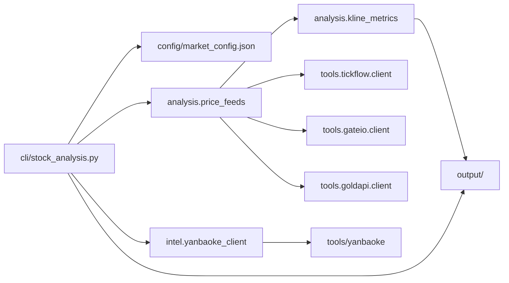

# Stock_Analysis

面向 **A 股 / 美股 / 港股（依数据源）**、**加密货币（Gate.io）** 与 **贵金属（Gold API）** 的 K 线分析 CLI：拉 OHLCV → 算结构指标 → 生成 Markdown / JSON；可选叠加 **研报客** 检索。风格接近 `CryptoTradeDesk`。

**合规**：仅技术分析与程序化演示，不构成投资建议。

---

## 主路径（第一次跑通）

在**本仓库根目录**依次执行：

1. **安装 Python 依赖**  
   `pip install -r requirements.txt`

2. **（可选）研报搜索**需 Node.js 18+，见下文「台账与研报」。

3. **跑一条默认简报**（读取 `config/market_config.json` 里的 `default_symbols`，数据源默认 `tickflow`）  
   `python cli/stock_analysis.py --market-brief --report-only --out-dir output`  
  - **多周期**：`--mtf-interval auto`（默认）：`1d` 主图下 tickflow 辅 `1w`；gateio 辅 `4h`；goldapi 辅 `1w`。`--no-mtf` 关闭。
  - **分析引擎**：`--analysis-style auto`（默认，`CRYPTO`/`gateio` 自动走 crypto 风格）；可手动指定 `stock` 或 `crypto`。
   - **结构过滤 / 时间止损**：写入 `ai_overview.json` 的 `stats` 与台账 `trade_journal.jsonl`（字段含 `structure_filter_flags`、`time_stop_deadline_utc`、`lifecycle_v1`、`mtf_aligned` 等）。

4. **看产物**（`--out-dir` 下；会话目录名为 **UTC 日期**）  
   - `output/<UTC日期>/ai_brief.md`  
   - `output/<UTC日期>/ai_overview.json`  
   - `output/<UTC日期>/full_report.md`  
   启用 `--with-research` 时另有：`output/research/<UTC日期>/`

5. **台账统计（独立命令）**  
   `python analysis/ledger_stats.py --journal output/trade_journal.jsonl`

**目录与文件一表**：见 `docs/NAMESPACE.md`（协作时先看该页）。

---

## 项目地图

### 目录职责

| 路径 | 职责 |
|------|------|
| `cli/` | 唯一编排入口：`stock_analysis.py`（参数、循环标的、写 `output/`） |
| `analysis/` | 业务分析内核：`price_feeds` 仅做 provider 分发与 OHLCV 归一化，指标/台账在本层（见 `docs/NAMESPACE.md`） |
| `intel/` | 研报情报：`yanbaoke_client.py`（调 Node 搜索、解析、落盘） |
| `market_data/` | **预留**：板块/概念成分、资金流等结构化数据（当前无实现） |
| `config/` | `market_config.json`（标的、`default_symbols`、`market` / `data_symbol`） |
| `tools/tickflow|gateio|goldapi/` | 行情 provider 客户端：外部 API 请求、超时与基础异常封装 |
| `tools/yanbaoke/` | 研报客 Node 脚本与 `SKILL.md` |
| `output/` | 运行产物（不入版本控制意义下的「工作区」，建议保持 gitignore） |

### 数据流（一次 `stock_analysis` 跑批）



---

## 扩展时改哪里

| 你想做… | 优先改 |
|----------|--------|
| 新行情源 / 新证券或商品代码规则 | `tools/<provider>/client.py` + `analysis/price_feeds.py`（前者实现 API，后者做分发与归一化） |
| 新指标、报告字段、Fib/威科夫逻辑 | `analysis/kline_metrics.py` |
| 台账统计口径 | `analysis/ledger_stats.py` |
| 新 CLI 子命令或参数 | `cli/stock_analysis.py` |
| 新研报平台 | `intel/` + `tools/yanbaoke/`，再在 CLI 里接线 |
| 板块/概念/官方成分股 | `market_data/`（新建模块，与 `analysis` 并列） |
| 默认标的列表 | `config/market_config.json` |

---

## 能力与指标（v1）

- **数据源（`--provider`）**：`tickflow`（默认）/ `gateio` / `goldapi`
- **输出**：简报、总览 JSON、全文报告；可选研报检索目录；台账 `trade_journal.jsonl` 及统计快照、可读版  
- **指标**：SMA20/60、近 1/5 根涨跌幅、近窗 swing 高/低、Fib 区间、趋势标签（偏多/偏空/震荡等）  
- **交易辅助**：威科夫背景过滤（`long_only` / `short_only` / `neutral`）+ 123 结构（P1/P2/P3、触发/止损/TP）

---

## 安装

```bash
pip install -r requirements.txt
```

研报客搜索需要 **Node.js 18+**（例如 Ubuntu：`sudo apt install -y nodejs npm`）。

---

## 常用命令

均在仓库根目录执行。

```bash
# 默认多标的简报（tickflow）
python cli/stock_analysis.py --market-brief --report-only --out-dir output

# 单标的
python cli/stock_analysis.py --symbol AAPL --interval 1d --limit 180 --report-only --out-dir output

# 简报 + 研报线索（需 Node）
python cli/stock_analysis.py --market-brief --report-only --out-dir output --with-research --research-n 5

# 贵金属（见下节 Gold API）
python cli/stock_analysis.py --provider goldapi --symbol AU9999 --interval 1d --limit 180 --report-only --out-dir output
```

---

## 配置（`config/market_config.json`）

- **`symbol`**：命令行里用的代码（如 `AAPL`、`600519.SH`、`AU9999`）  
- **`name`**：展示名  
- **`market`**：`CN` / `US` / `PM`（贵金属，配合 `goldapi`）等  
- **`data_symbol`**：传给数据源的代码（A 股如 `600519.SH`，美股如 `AAPL`，贵金属如 `Au9999` 或 `goldid` 如 `1053`）  
- **`default_symbols`**：仅填已存在于 `assets` 的 `symbol`

---

## 数据源与环境变量

| provider | 说明 | 环境变量（摘要） |
|----------|------|------------------|
| `tickflow` | 默认；无 Key 可走免费日线 | 可选 `TICKFLOW_API_KEY` 用完整服务 |
| `gateio` | 加密货币现货 K 线（如 `BTC_USDT`） | 无需 Key（公共行情接口） |
| `goldapi` | [Gold API](https://gold-api.cn) 贵金属 | provider 客户端在 `tools/goldapi/client.py`；可用 **`GOLD_API_APPKEY`** / **`GOLD_API_KEY`** 覆盖；可选 **`GOLD_API_BASE`** |

---

## 外部 API 总览

当前项目接入 **4 类外部 API 能力**（其中行情源 3 类 + 研报情报 1 类）：

- **行情 API（3）**：`tickflow`、`gateio`、`goldapi`
- **情报 API（1）**：`yanbaoke`（研报客）

| 能力分类 | 名称 | 默认是否启用 | 是否需要 Key | 典型触发命令 |
|---|---|---|---|---|
| 行情 | `tickflow` | 是（`--provider` 默认） | 可选（无 Key 走免费域名） | `python cli/stock_analysis.py --market-brief --report-only --out-dir output` |
| 行情 | `gateio` | 否（需显式指定） | 否 | `python cli/stock_analysis.py --provider gateio --symbol BTC_USDT --interval 1d --report-only --out-dir output` |
| 行情 | `goldapi` | 否（需显式指定） | 是（内置默认 key，可被环境变量覆盖） | `python cli/stock_analysis.py --provider goldapi --symbol AU9999 --interval 1d --report-only --out-dir output` |
| 研报情报 | `yanbaoke` | 否（需 `--with-research`） | 搜索否 / 下载是 | `python cli/stock_analysis.py --market-brief --report-only --out-dir output --with-research --research-n 5` |

---

## 贵金属（Gold API）

- **默认日线 K 线**：``GET {GOLD_API_BASE}/api/v1/kline``，``period=1440``（分钟 = 1 日）、``symbol``、``limit``、鉴权（``api.gold-api.cn`` 用 ``apikey``，其余与 history 一样用 ``appkey``，由代码按主机名选择）。可用 **`GOLD_API_KLINE_URL`** 覆盖为完整 K 线 URL；可选 **`GOLD_API_KLINE_PERIOD`** 改日线分钟数（默认 **1440**）。失败或有效根数不足时回退 **history**。
- **回退**：``GET .../api/v1/gold/history``（``goldid``、日期区间、``limit``、``appkey``）；若返回细粒度 K 线，仍按**日历日**聚合成日线再算指标。  
- **品种**：`Au9999` / `goldid` 等，见 `GET /api/v1/gold/varieties`。CLI：**`goldapi` + `interval=1d`**。  
- **配额 / 公开仓库**：套餐为准；建议生产环境仅用环境变量注入 key。

---

## 台账与研报

- **台账**：若跑出 123 候选，会追加 `output/trade_journal.jsonl`，并刷新 `trade_journal_stats_latest.md`、`trade_journal_readable.md`、`trade_journal_readable.csv`。
- **研报客**：`intel/yanbaoke_client.py` → `tools/yanbaoke/scripts/search.mjs`；**搜索**一般无需 Key，**下载**需 `YANBAOKE_API_KEY`（见 `tools/yanbaoke/SKILL.md`）。

---

## 报告字段怎么读（威科夫 + 123）

- **背景**：`long_only` 偏多头计划，`short_only` 偏空头，`neutral` 不强行给方向。  
- **123**：按 P1/P2/P3、`entry`、`stop`、`tp1`/`tp2` 读；未触发勿写成已入场。  
- **R 含义**：TP 相对止损空间约 1.5R / 2.5R。

---

## AI / 自动化约定

- **给人看的操作说明**：本 README。  
- **给 Agent 的执行契约**：`.cursor/rules/stock-analysis-agent.mdc` + `AI_股票对话提示.md`（默认命令、读产物顺序、研报与资金流的边界说明）。  
- **文件速查**：`docs/NAMESPACE.md`。
