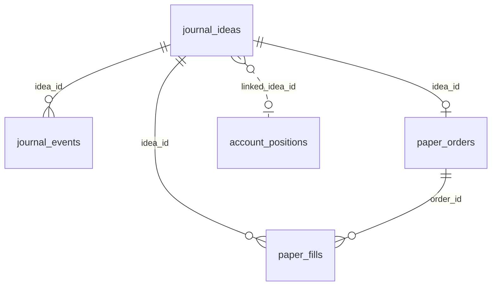

# PostgreSQL 数据库设计（台账 / 纸交易 / 模拟账户）

本文描述本仓库 **Alembic 迁移**所定义的 **业务表**（不含 Alembic 自带的 `alembic_version`）。权威 DDL 以 `alembic/versions/` 下脚本为准；若与运行时代码不一致，以迁移为 schema 真源，并应通过新 revision 对齐。

## 1. 迁移链与如何建库

| Revision | 文件 | 内容 |
|----------|------|------|
| `journal_001` | `journal_001_core_tables.py` | `journal_ideas`、`journal_events`、`analysis_snapshots` |
| `journal_002` | `journal_002_paper_orders_fills.py` | `paper_orders`、`paper_fills` |
| `journal_003` | `journal_003_account_system.py` | `account_ledger`、`account_positions`、`account_events` |
| `journal_004` | `journal_004_seed_account_ledger.py` | 按 YAML `accounts` 为每个币种幂等插入首条 **`account_ledger`**（`reason='init'`），无行才写 |

配置 **`database.postgres.dsn`** 后，于仓库根目录执行：

```bash
alembic upgrade head
```

常用只读查询示例见 **`docs/SQL_AI_REFERENCE.md`**；运行时从 `sql/` 加载的 DML 见 `persistence/sql_loader.py`。

台账、纸交易、账户账本均依赖 **`persistence.db.get_sqlalchemy_engine()`**（有 DSN 则建池；无 DSN 时编排仍可跑，但 PG 相关写入为 no-op）。

## 2. 表一览（共 8 张业务表）

| 表名 | 域 | 主要职责 |
|------|------|----------|
| `journal_ideas` | 台账 | 每条 idea 的当前状态与计划字段（标的、周期、方向、进出场、RR、标签等） |
| `journal_events` | 台账 | idea 维度事件流水（成交、止盈止损出局、创建等） |
| `analysis_snapshots` | 分析 | 可选：按时间点的分析快照（迁移已建表） |
| `paper_orders` | 纸交易 | 模拟委托单 |
| `paper_fills` | 纸交易 | 模拟成交明细 |
| `account_ledger` | 账户 | 按币种资金池的余额/可用/占用等**时间序列快照** |
| `account_positions` | 账户 | 模拟持仓行（开/平、盈亏、关联订单与 idea） |
| `account_events` | 账户 | 通用账户事件（迁移已建表，业务写入预留） |

## 3. 表间关系（逻辑）



- `paper_orders.idea_id`、`paper_fills.idea_id` 外键引用 `journal_ideas(idea_id)`，`ON DELETE CASCADE`。
- `paper_fills.order_id` 外键引用 `paper_orders(order_id)`，`ON DELETE CASCADE`。
- `account_ledger` / `account_positions` / `account_events` **无外键**指向 `journal_ideas`；与台账通过 **`linked_idea_id`、稳定 `order_id`（如 `paper_trade_service.stable_order_id`）** 在应用层对齐。

## 4. 各表说明与字段（与迁移一致）

### 4.1 `journal_ideas`

**用途**：结构化交易想法的主表；运行时以 **`journal_ideas` 为读写真源**（`persistence/journal_repository_factory.py` → `PostgresJournalRepository`）。编排层在同会话目录放置无扩展名锚点文件 `journal`，供 `write_latest_stats` 定位统计 Markdown 输出目录。

**主要字段（节选）**：`idea_id`（唯一）、`symbol`、`market`、`provider`、`interval`、`plan_type`、`direction`、`status`、`exit_status`、入场区间与价、止损/TP、RR、`structure_flags` / `meta` / `lifecycle_v1`（jsonb）、`created_at` / `updated_at`、`valid_until`、`filled_at` / `closed_at`、`fill_price` / `closed_price`、`realized_pnl_pct` / `unrealized_pnl_pct` 等。

**索引**：`symbol+interval`、`status`、`created_at`、`market+status`；`structure_flags`、`meta` 上 GIN。

**写入入口**：`persistence/journal_repository_pg.py`（`save_entries` UPS、`append_idea` 等），由 `persistence/journal_repository_factory.get_journal_repository` 选用。

---

### 4.2 `journal_events`

**用途**：append-only 事件流，便于审计与回放。

**字段**：`id`、`idea_id` → `journal_ideas(idea_id)`、`event_type`、`old_status`、`new_status`、`event_time`、`payload`（jsonb）。

**索引**：`(idea_id, event_time DESC)`。

**典型 `event_type`**：`idea_created`、`filled`、`closed_tp`、`closed_sl` 等（以 `app/journal_service.py` 为准）。

---

### 4.3 `analysis_snapshots`

**用途**：按 symbol/provider/interval 存储某一时刻的分析摘要（趋势、最新价、Fib、风险标记、原始统计、来源会话路径等）。

**状态**：迁移已创建表；当前 `app/` 下**无默认写入路径**（预留；规划见 `docs/POSTGRESQL_JOURNAL_MIGRATION_PLAN.md`）。

---

### 4.4 `paper_orders`

**用途**：纸交易委托维度（与真实交易所「挂单生命周期」的完整模拟可逐步扩展）。

**字段**：`order_id`（唯一）、`idea_id` → `journal_ideas`、`symbol`、`market`、`provider`、`interval`、`side`、`order_type`、`tif`、`requested_qty` / `requested_notional`、各类价格、`status` / `status_reason`、时间戳、`simulation_rule`、`meta`。

**索引**：`idea_id`；`(status, created_at)`。

**写入入口**：`persistence/paper_trade_service.py`（入场：`create_entry_order_and_fill`；当前入场行 **`status` 多为 `filled`**，即「入场即成交」简化模型）。

---

### 4.5 `paper_fills`

**用途**：纸交易成交明细；与 `paper_orders` 一对多（同一 `order_id` 下可多笔 fill）。

**字段**：`fill_id`（唯一）、`order_id`、`idea_id`、`symbol`、`side`、`fill_qty`、`fill_price`、`fill_notional`、`fee` / `fee_currency`、`slippage_bps`、`fill_time`、`fill_seq`、`fill_source`、`meta`。

**约束与索引**：唯一索引 **`(idea_id, fill_seq)`**（约定如 `1`=开仓、`2`=平仓）；`order_id+fill_time`、`idea_id+fill_time`。

**写入入口**：`persistence/paper_trade_service.py`（`create_entry_order_and_fill`、`create_exit_fill`）。

---

### 4.6 `account_ledger`

**用途**：按 **`account_id`（币种维度，如 CNY、USD）** 追加资金快照，**非**单条 SQL 原地改余额。

**字段**：`id`、`account_id`、`balance`、`available`、`used_margin`、`unrealized_pnl`、`equity`、`snapshot_time`、`reason`、`meta`。

**`reason` 典型值**：`init`、`deposit`、`withdraw`、`adjustment`、`position_open`、`position_close`、`mark_to_market`（见 `persistence/account_service.py`）。

**索引**：`(account_id, snapshot_time DESC)`。

**写入入口**：`persistence/account_service.py`（显式 **`deposit_funds` / `withdraw_funds` / `adjust_funds`**；`open_position`、`close_position`、`mark_to_market`；读快照用 `get_or_init_account`）。CLI：`scripts/account_cash_move.py`。无有效 PG 引擎时上述函数对库为 no-op。

**首条 `init` 快照**：由 Alembic **`journal_004`** 在 `upgrade` 时按当前 YAML `accounts` 写入（某 `account_id` 在 `account_ledger` 已存在任意行则跳过）。运行时 **不再** 在 `get_or_init_account` 中自动补 `init`；若 PG 无快照，头寸计算返回 `ledger_not_initialized`，`open_position` 会中止并打错误日志。

**头寸计算用哪里的余额**：`analysis/position_sizing.calculate_qty_for_idea` 在 **能连上 PG** 时读 **`account_ledger` 最新 `available`**（经 `get_or_init_account`）；若账本未初始化则 `balance_source` 为 **`ledger_not_initialized`** 并降级。无引擎时退回 YAML `accounts` 的 `initial_balance` / `balance`（仅用于单测/无库环境）。若调用方传入 **`account_ledger={"available": …}`**，则优先使用该值。`detail` 中含 **`balance_source`**：`caller` | `database` | `config` | `ledger_not_initialized`。

---

### 4.7 `account_positions`

**用途**：模拟持仓行；平仓时 **UPDATE** 为 `closed` 并写实现盈亏等。

**字段**：`id`、`account_id`、`symbol`、`market`、`direction`、`status`、`qty`、`entry_price` / `entry_notional`、`exit_price` / `exit_notional`、`unrealized_pnl`、`realized_pnl`、`realized_pnl_pct`、`opened_at` / `closed_at`、`linked_order_id`、`linked_idea_id`、`meta`。

**索引**：`(account_id, status)`。

**写入入口**：`persistence/account_service.py`（`open_position` INSERT、`close_position` UPDATE）。

**实现注意**：`persistence/account_service.py` 的 `close_position` 在 UPDATE 中使用了 **`close_reason`** 列；若你使用的数据库仅执行到 `journal_003` 的原始 DDL 且**未**包含该列，需在数据库中增加该列或补充 Alembic revision，否则平仓 UPDATE 会失败。

---

### 4.8 `account_events`

**用途**：账户侧通用事件流水（扩展用）。

**状态**：迁移已建表；当前业务路径**默认不写**。

---

## 5. 生命周期与表变动（摘要）

### 5.1 Idea 变为已成交 `filled`

在 **PostgreSQL 可用** 时，典型顺序见 `app/journal_service.py`：

1. **`journal_ideas`**：UPSERT 更新状态与成交价等。  
2. **`journal_events`**：INSERT，`event_type = filled`。  
3. **`paper_orders`**：INSERT（幂等 `ON CONFLICT DO NOTHING`）。  
4. **`paper_fills`**：INSERT，`fill_seq = 1`。  
5. **`account_positions`**：INSERT `open`。  
6. **`account_ledger`**：INSERT **`position_open`**（依赖迁移 **`journal_004`** 或既有数据已存在 **`reason='init'`** 快照；否则 `open_position` 中止）。

### 5.2 Idea 变为已关闭 `closed`（`exit_status` 为 `tp` / `sl`）

1. **`journal_ideas`**：UPSERT 为 `closed` 等。  
2. **`journal_events`**：INSERT，`closed_tp` / `closed_sl`。  
3. **`paper_fills`**：INSERT，`fill_seq = 2`（**不**必更新 `paper_orders` 行，当前实现平仓只增 fill）。  
4. **`account_positions`**：UPDATE 为 `closed`。  
5. **`account_ledger`**：INSERT **`position_close`**。

## 6. 配置与代码索引

| 主题 | 路径 |
|------|------|
| DSN / backend | `config/analysis_defaults.example.yaml`、`config/runtime_config.py` |
| Engine | `persistence/db.py` |
| 台账 PG | `persistence/journal_repository_pg.py` |
| 台账工厂 | `persistence/journal_repository_factory.py`（仅 `PostgresJournalRepository`） |
| 纸交易 | `persistence/paper_trade_service.py` |
| 头寸与余额口径 | `analysis/position_sizing.py`（`balance_source`）、`persistence/account_service.py`；账户种子迁移 `journal_004` |
| 成交后编排 | `app/journal_service.py` |
| 账户 YAML（起跑线，非自动回写 PG） | `config/analysis_defaults.yaml` → `accounts` |

## 7. 相关文档

- `docs/POSTGRESQL_JOURNAL_MIGRATION_PLAN.md`：迁移与产品规划（含 `analysis_snapshots` 等扩展讨论）  
- `docs/PAPER_TRADING_ORDER_FILL_PLAN.md`：纸交易订单/成交设计笔记  

---

*文档随迁移演进；修改 schema 时请同步更新 `alembic/versions/` 与本文件。*
